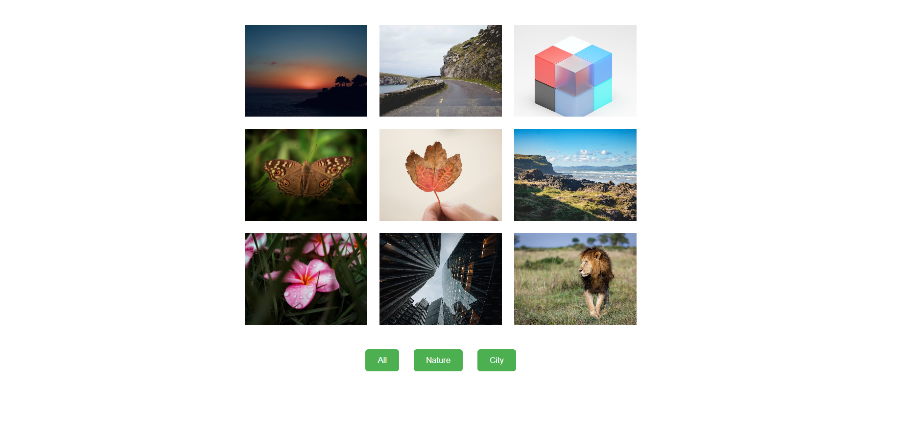

# 📸 Image Gallery

A modern, fully responsive **Image Gallery** built with **HTML**, **CSS**, and **JavaScript**.  
The project features category-based filtering, hover animations, a lightbox viewer with next/prev navigation, and smooth transitions for an elegant user experience.

---

## 🔰 Badges

---

## 📖 Overview

This Image Gallery showcases a clean layout designed with **HTML & CSS**, enhanced with **JavaScript** for interactivity and navigation.  
It includes image filtering (City, Nature), hover effects, and a lightbox view to preview images in full size.

The gallery uses **9 images**, all stored inside the `/images` folder.

---

## ✨ Features

- 📁 **Responsive grid layout** for different screen sizes
- 🖼️ **Lightbox viewer** for enlarged image display
- ⏭️ **Next/Prev navigation** inside the lightbox
- 🎯 **Category filters** (City, Nature)
- 🖱️ **Interactive hover effects**
- ⚡ **Smooth transitions & animations**
- 📱 **Optimized mobile experience**

---

## 🔗 Live Demo

> [Live Demo](https://noftyfootie.github.io/CodeAlpha_Image_Gallery/)

---

## 📷 Screenshots

> 

---

## 🛠️ Technologies Used

| Technology     | Purpose                          |
| -------------- | -------------------------------- |
| **HTML5**      | Structure & layout               |
| **CSS3**       | Styling, transitions, animations |
| **JavaScript** | Filtering, lightbox, navigation  |

---

## 📂 Folder Structure

| File / Folder                  | Type   | Description                           |
| ------------------------------ | ------ | ------------------------------------- |
| `images/`                      | Folder | Contains all gallery images and icons |
| `images/img1.jpg`              | Image  | Gallery image 1                       |
| `images/img2.jpg`              | Image  | Gallery image 2                       |
| `images/img3.jpg`              | Image  | Gallery image 3                       |
| `images/img4.jpg`              | Image  | Gallery image 4                       |
| `images/img5.jpg`              | Image  | Gallery image 5                       |
| `images/img6.jpg`              | Image  | Gallery image 6                       |
| `images/img7.jpg`              | Image  | Gallery image 7                       |
| `images/img8.jpg`              | Image  | Gallery image 8                       |
| `images/img9.jpg`              | Image  | Gallery image 9                       |
| `images/camera_sign_icon.webp` | Image  | Title icon / favicon                  |
| `images/readme_screenshot.png` | Image  | Screenshot for README                 |

---

## ⚙️ Installation & Setup

### Option — Download ZIP

Download the project ZIP

Extract all files

Open index.html in your browser

▶️ How It Works

Click a category button to filter images

Hover over images to see animation effects

Click an image to open it in a lightbox

Use Next/Prev arrows to navigate

Click on the close button to exit lightbox

🎨 Customization
Add More Images

Add new images to /images folder

Add new  elements index.html

Assign category classes such as city or nature

Modify Styles

Open image.css

Update grid layout, hover effects, transitions, etc.

Add New Filters

Add new buttons in index.html

Update filtering logic in image.js

🤝 Contributing

Contributions are welcome!
Follow the steps below:

Fork the repository

Create a new branch

Make your changes

Submit a pull request

📜 License

This project is licensed under the MIT License.
You are free to use and modify it.

✍️ Author

NoftyDev
GitHub Handle: NoftyFootie
